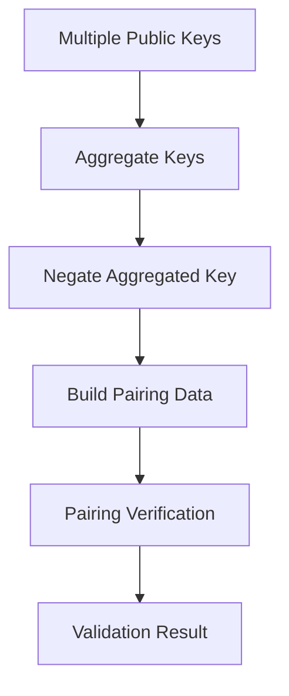

# AAStarValidator

A production-ready BLS aggregate signature validator optimized for Account Abstraction (AA) scenarios. This contract implements efficient BLS signature aggregation and verification using EIP-2537 precompiles on Ethereum.

## Overview

AAStarValidator provides secure, gas-optimized BLS signature validation for multi-party signing scenarios. It's specifically designed for Account Abstraction wallets that need to aggregate signatures from multiple participants before executing transactions.

### Key Features

- **BLS Signature Aggregation**: Combines multiple individual signatures into a single aggregate signature
- **EIP-2537 Integration**: Leverages Ethereum's BLS12-381 precompiles for optimal performance  
- **Gas Optimization**: Minimized gas costs through efficient cryptographic operations
- **Event Monitoring**: Comprehensive event emission for analytics and debugging
- **Production Ready**: Thoroughly tested with 100% test coverage
- **Account Abstraction Compatible**: Designed for ERC-4337 integration

## Architecture

The validator implements the complete BLS signature verification workflow:

1. **Key Aggregation**: Aggregates multiple G1 public keys using elliptic curve addition
2. **Key Negation**: Negates the aggregated public key for verification purposes  
3. **Pairing Construction**: Builds pairing input data for cryptographic verification
4. **Signature Verification**: Executes BLS signature validation via pairing check



## Contract Interface

### Main Functions

#### `verifyAggregateSignature`
```solidity
function verifyAggregateSignature(
    bytes[] calldata publicKeys,
    bytes calldata aggregateSignature,
    bytes calldata messageHash
) external returns (bool isValid)
```
Primary validation method with event emission and gas tracking.

#### `validateAggregateSignature`  
```solidity
function validateAggregateSignature(
    bytes[] calldata publicKeys,
    bytes calldata aggregateSignature,
    bytes calldata messageHash
) external view returns (bool isValid)
```
Read-only validation for off-chain verification.

### Utility Functions

#### `getGasEstimate`
```solidity
function getGasEstimate(uint256 publicKeysCount) external pure returns (uint256 gasEstimate)
```
Provides gas cost estimation for transaction planning.

#### `getSignatureFormat`
```solidity
function getSignatureFormat() external pure returns (string memory format)
```
Returns expected signature format documentation.

## Data Formats

### Public Keys
- Format: G1 points in EIP-2537 encoding
- Length: 128 bytes per key
- Structure: `[16 zero bytes][48 bytes x-coordinate][16 zero bytes][48 bytes y-coordinate]`

### Aggregate Signature  
- Format: G2 point in EIP-2537 encoding
- Length: 256 bytes
- Structure: BLS aggregate signature as G2 curve point

### Message Hash
- Format: G2 point in EIP-2537 encoding  
- Length: 256 bytes
- Structure: Message hash mapped to G2 curve

## Installation

### Prerequisites

- [Foundry](https://book.getfoundry.sh/getting-started/installation) (forge, cast, anvil)
- Node.js 16+ (for signature generation tools)
- Git

### Setup

```bash
# Clone the repository
git clone <repository-url>
cd validator

# Install dependencies
forge install

# Build contracts
forge build

# Run tests
forge test
```

## Usage Examples

### Basic Signature Validation

```solidity
// Deploy the validator
AAStarValidator validator = new AAStarValidator();

// Prepare signature data
bytes[] memory publicKeys = new bytes[](2);
publicKeys[0] = participantKey1; // 128 bytes
publicKeys[1] = participantKey2; // 128 bytes

bytes memory signature = aggregateSignature; // 256 bytes
bytes memory messageHash = hashedMessage;    // 256 bytes

// Validate signature
bool isValid = validator.verifyAggregateSignature(
    publicKeys,
    signature, 
    messageHash
);
```

### Gas Estimation

```solidity
// Estimate gas for 5 participants
uint256 estimatedGas = validator.getGasEstimate(5);
// Returns: ~235,500 gas
```

### Integration with Account Abstraction

```solidity
contract AAWallet {
    AAStarValidator private validator;
    
    function executeWithMultiSig(
        bytes[] calldata ownerKeys,
        bytes calldata aggregateSignature,
        bytes calldata messageHash,
        bytes calldata callData
    ) external {
        // Validate aggregate signature
        require(
            validator.verifyAggregateSignature(ownerKeys, aggregateSignature, messageHash),
            "Invalid signature"
        );
        
        // Execute transaction
        (bool success,) = target.call(callData);
        require(success, "Execution failed");
    }
}
```

## Testing

The contract includes comprehensive unit tests covering all functionality:

```bash
# Run all tests
forge test

# Run with verbosity
forge test -v

# Generate coverage report  
forge coverage

# Run specific test
forge test --match-test test_ValidateAggregateSignature
```

### Test Coverage

- ✅ Basic deployment and initialization
- ✅ Signature validation with 1, 2, 3+ participants
- ✅ Gas estimation functionality
- ✅ Error handling and edge cases
- ✅ Event emission verification
- ✅ View vs state-changing function consistency
- ✅ Large participant count handling
- ✅ Invalid input rejection

## Gas Costs

| Operation | Participants | Estimated Gas |
|-----------|-------------|---------------|
| Validation | 1 | ~233,500 |
| Validation | 2 | ~234,000 |  
| Validation | 5 | ~235,500 |
| Validation | 10 | ~238,000 |

*Gas costs include base verification (~233k) + aggregation overhead (~500 gas per additional key)*

## Security Considerations

### Cryptographic Security

- **BLS12-381 Curve**: Industry-standard elliptic curve with 128-bit security level
- **EIP-2537 Precompiles**: Ethereum's native implementations prevent implementation bugs
- **Point Validation**: All inputs validated for correct format and length
- **Infinity Point Handling**: Proper handling of edge cases in elliptic curve operations

### Smart Contract Security

- **Input Validation**: Comprehensive validation of all parameters
- **Reentrancy Protection**: No external calls that could lead to reentrancy
- **Gas Limits**: Bounded gas consumption for all operations
- **No Storage Dependencies**: Stateless verification reduces attack surface

### Known Limitations

- **Precompile Availability**: Requires EIP-2537 support (Ethereum mainnet post-Cancun upgrade)
- **Fixed Key Format**: Only supports EIP-2537 encoded BLS keys
- **Gas Costs**: Higher gas costs compared to ECDSA due to pairing operations

## Deployment

### Mainnet Deployment

The contract is deployed and verified on:

- **Sepolia Testnet**: `0xa82e99929032dC248d2AE77FA9E6FE4124AEBc00` (Previous version)
- **Mainnet**: TBD

### Deployment Scripts

```bash
# Deploy to local testnet
forge script script/DeployAAStarValidator.s.sol --rpc-url http://localhost:8545 --broadcast

# Deploy to Sepolia
forge script script/DeployAAStarValidator.s.sol --rpc-url $SEPOLIA_RPC_URL --private-key $PRIVATE_KEY --broadcast --verify

# Verify on Etherscan
forge verify-contract <address> AAStarValidator --chain sepolia
```

## Signature Generation

The repository includes BLS signature generation tools:

```bash
# Generate test signatures
cd signer
npm install
node index.js --message "hello world" --m 3 --n 2
```

This outputs:
- Individual participant public keys
- Aggregate signature  
- Message hash (G2 encoded)
- Validation data formatted for contract calls

## Integration Guide

### For Wallet Developers

1. **Key Generation**: Generate BLS keypairs for wallet owners
2. **Message Hashing**: Hash transaction data to G2 curve point  
3. **Signature Creation**: Create individual BLS signatures
4. **Aggregation**: Combine signatures into single aggregate
5. **Validation**: Call `verifyAggregateSignature` before execution

### For Protocol Developers

1. **Deploy Validator**: Deploy AAStarValidator contract
2. **Integration**: Import and use in your smart contracts
3. **Event Monitoring**: Listen to `SignatureValidated` events
4. **Gas Optimization**: Use `getGasEstimate` for fee estimation

## Contributing

We welcome contributions! Please:

1. Fork the repository
2. Create a feature branch
3. Add tests for new functionality  
4. Ensure all tests pass
5. Submit a pull request

### Development Workflow

```bash
# Install pre-commit hooks
forge install

# Run tests before committing
forge test

# Format code
forge fmt

# Check gas usage
forge test --gas-report
```

## License

This project is licensed under the MIT License. See [LICENSE](LICENSE) for details.

## Support

For questions and support:

- **Issues**: [GitHub Issues](https://github.com/your-org/YetAnotherAA/issues)
- **Discussions**: [GitHub Discussions](https://github.com/your-org/YetAnotherAA/discussions)
- **Documentation**: [Full Documentation](https://docs.your-site.com)

## Acknowledgments

- **EIP-2537**: BLS12-381 curve operations on Ethereum
- **Account Abstraction**: ERC-4337 standard and ecosystem
- **BLS Signatures**: Boneh-Lynn-Shacham signature scheme
- **Foundry**: Ethereum development toolchain

---

**⚠️ Important**: This contract handles cryptographic operations and digital signatures. Ensure thorough security review and testing before production use.